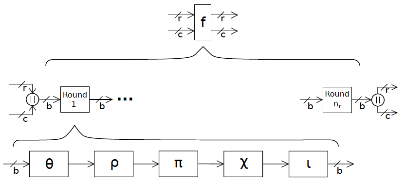

# SHA3 Implemention in WebAssembly Text

This is a work in progress

An implementation of the SHA3 algorithm in WebAssembly Text based on the specification published as NIST FIPS 202 https://nvlpubs.nist.gov/nistpubs/FIPS/NIST.FIPS.202.pdf

# Overview

The SHA3 algorithm can be used in two modes:
* As a drop-in replacement for SHA2, or in
* Extendable output function (XOF) mode

This implementation focusses only on using SHA3 as a drop-in replacement for SHA2.
Using SHA3 in XOF mode may be implemented in the future.

Given that this implementation is a drop-in replacement for SHA2, the length `d` of the generated digest must exacly match the digest lengths generated by SHA2.
Therefore, `d` may only be one of `224`, `256`, `384`, or `512` bits.

## SHA3 Internal State

The SHA3 algorithm is fed input data that is used to manipulate an internal state, referred to in some literature as an "entropy pool".

This internal state is treated as a 3-dimensional matrix having the dimensions `5 * 5 * w`, where `w = 2^l` and `l` is an integer in the range `0..6`.

The size (`b`) of the internal state in bits may therefore only be one of:

| `l` | Calculation | Internal<br>State Size
|---|---|--:
| `0` | `5 * 5 * 2^0` | `25`
| `1` | `5 * 5 * 2^1` | `50`
| `2` | `5 * 5 * 2^2` | `100`
| `3` | `5 * 5 * 2^3` | `200`
| `4` | `5 * 5 * 2^4` | `400`
| `5` | `5 * 5 * 2^5` | `800`
| `6` | `5 * 5 * 2^6` | `1600`

Choosing values of `l < 3` gives state sizes that are only of use when analyzing the algorithm's behaviour.
Such values should not be used in practice.

However, implementing SHA3 as a SHA2 replacement requires `l` to be fixed at `6`, meaning that the internal state will always be `1600` bits.

### Partitioning the Internal State

The internal state is subdivided into two regions known as the `rate` (of size `r`) and the `capacity` (of size `c`) such that `r + c = b`.  Therefore in our case, `r + c = 1600`.

The `rate` is the region into which the input data is written and from which the output digest will be taken.
It has this name because its size determines the rate at which the input data can be consumed.

The `capacity` however is never made public.  Its purpose is to act as a hidden entropy pool into which the data bits in the `rate` are thoroughly mixed.

Further to this, the size `c` of the capacity must be twice the size of the output digest length `d`, thus `c = 2d` making `r = 1600 - 2d`.

Given the constraints on the output digest size `d`, the sizes of `r` and `c` may only be one of the following pairs (in bits):

| `d` | Security<br>Level | Calculation | `r` | `c`
|--:|--:|---|--:|--:
| `224` | `112` | `r = 1600 - (2 * 224)` | `1152` |  `448` |
| `256` | `128` | `r = 1600 - (2 * 256)` | `1088` |  `512` |
| `384` | `192` | `r = 1600 - (2 * 384)` |  `768` |  `832` |
| `512` | `256` | `r = 1600 - (2 * 512)` |  `576` | `1024` |


## The "Keccak" Function

SHA3 manipulates the input data using a function that has been given the made up name of "Keccak" (pronounced "ket chak").

The Keccak function belongs to a category of functions known as "sponge" functions.
This name has been chosen because like a physical sponge, this function first "absorbs" any amount of data into its internal state, then "squeezes" out a result.

What makes the SHA3 function fundamentally different from the earlier SHA functions, is that the "squeeze" operation can be performed an unlimited number of times; hence, when used in XOF mode, the Keccak function can act as a psuedo-random number generator.

## Input Block Padding

The input data is divided into some number (`t`) of blocks of the same size as the rate where `t` is given by:

```javascript
let t = Math.floor(file_size_in_bits / rate) + (file_size_in_bits mod rate < 4 ? 1 : 0)
```

The last block must be padded so that the data being processed fills an integer number of blocks.

The padding rules depend on whether SHA3 is being used in SHA2-replacement mode, or XOF mode.
In our case, we are only concerned with SHA2-replacement mode, so the padding rules are as follows:

* The data must be suffixed with the two padding marker bits `01`
* The padding marker must be followed by a variable length bit sequence that:
   * Starts and ends with bit `1`
   * Between the start and end `1`s there must be zero or more bit `0`s

Thus, if the size of data `n` in the last block is 4 or more bits smaller than the rate `r`, the last block will be padded as follows:

| Size of data<br> in last block | Padding<br>marker | Padding<br>bit sequence | Complete<br>bit string
|---|---|---|---
| `r-4` | `01` | `11` | `0111`
| `r-5` | `01` | `101` | `01101`
| `r-6` | `01` | `1001` | `011001`
| `r-7` | `01` | `10001` | `0110001`
| `r-n` | `01` | `1[n-4 * 0]1` | `0110...01`

In the event that the block size is 3 or fewer bits smaller than the rate `r`, then the remaining bits are padded using the same scheme as above, but the padding string spills over into a new block:

| Size of data<br>in last block | Padding bit<br>sequence in<br>last block | Padding bits<br>in extra block
|---|---|---
| `r-3` | `011` | `[r-1 * 0]1`
| `r-2` | `01` | `1[r-2 * 0]1`
| `r-1` | `0` | `11[r-3 * 0]1`
| `r` | | `011[r-4 * 0]1`

Note that if the data is an exact integer multiple of the block size `r`, then an extra block containing only the padding string is always added.

## Keccak-f Input Processing

Now that the input data `X` has been organised into some integer number `t` of blocks of size `r` (the last of which has been appropriately padded), the "absorb" phase performs the following loop:

```rust
  // Internal state starts as 200 initialised u64s
  let mut state[u64; 200] = [0; 200];
  // The rate size in bits is given by 1600 - (2 * digest_size)
  // Assuming a digest size of 256 bits the rate size = 1600 - (2 * 256) = 1088
  let rate_size = 1088 >>> 6;  // As u64 words

  for idx in X.size {
    state = keccak_f([state[0..rate_size] XOR X[idx], ...state[rate_size..]])
  }
```

Each time a new block is read from the input data, it is `XOR`ed with the current rate and the resulting internal state passed to the Keccak function.
This process is performed as many times as needed to fully "absorb" the input data.


When SHA3 is being used in SHA2 replacement mode, after the absorb phase has completed, the required hash value is obtained simply by taking the required number of bits from the rate at `Y(0)`.
However, when SHA3 is being used in XOF mode, at least one further round of the squeeze phase is performed, yielding `Y(1)`.
At this point you may take as output any number of bits from the rate (up to the full size of the rate), and then perform any number of further squeeze rounds to continue generating psuedo-random data.

This process is entirely deterministic.
For the same input followed by the same number of squeeze rounds, the same output data will always be generated.

## Indexing Convention within the Internal State Matrix

This module follows the state array indexing convention described in section 3.1.4 of the above document


The linear order of the data in expected test results starts in the bottom left corner `(3,3)` of the above matrix.

The array data then follows the order `(3,3), (4,3), (0,3), (1,3), (2,3)` followed by `(3,4), (4,4), (0,4), (1,4), (2,4)`, then `(3,0), (4,0), (0,0), (1,0), (2,0)` etc.

# How the Keccak Function Works Internally

In this example, the internal state is always 1600 bits, and the required digest output size `d` is 256 bits; therefore, the rate will be:

```
rate = 1600 - 2 * d
     = 1600 - 2 * 256
     = 1088 bits
```

1. To start with, the Keccak function's internal state is initialised to 200 bytes of `0x00`.

2. Consume `rate` bits from the input file/stream.
   If the input supplies less than `rate` bits, then pad the input data such that it fills a complete rate block as described above.

3. XOR the input data with the data already present in the rate region of the internal state.

4. Perform 24 rounds of the five step functions documented below against the data in the internal state.

5. Did step 2 hit end of file?

   No? - Goto step 2<br>Yes?  - Goto step 6

6. We're done - the required digest is the first `d` bits in the rate region of the internal state.

## Internal Step Functions

Each of the five, internal step functions is identified with a Greek letter and they are always executed in the following order:

* &theta; Theta
* &rho; Rho
* &pi; Pi
* &chi; Chi
* &iota; Iota



## &theta; Theta

This function performs three basic internal steps:

1. Step Theta-C takes each column in the 5x5 matrix and XORs the `u64` row values together, thus collapsing a entire column down to a single `u64`.

   ```rust
   fn theta_c(state: [[u64; 5]; 5]) -> [u64; 5] {
       let mut result: [u64; 5] = [0; 5];
       for x in 0..4 {
           for y in 0..4 {
               result[x] = result[x] ^ state[x][y];
           }
       }

       result
   }
   ```
2. Step Theta-D takes the Theta-C output and for each `u64`, XORs the previous value MOD 5 with the next value MOD 5 rotated right by one bit

   ```rust
   fn theta_d(c: [u64; 5]) -> [u64; 5] {
       let mut result: [u64; 5] = [0; 5];
       for i in 0..4 {
           let prev: u64 = c[if i == 0 { 4 } else { i-1 }];
           let next: u64 = c[i+1 % 5];
           result[i] = prev ^ (next >> 1);
       }
       result
   }
   ```
3. The last step inside the Theta function is to XOR every column value in row `y` with the `y`'th value from the Theta-D step output

   ```rust
   fn theta(state: [[u64; 5]; 5]) -> [[u64; 5]; 5] {
       let mut result: [[u64; 5]; 5] = [[0; 5]; 5];
       let c = theta_c(state);
       let d = theta_d(c);

       for y in 0..4 {
           for x in 0..4 {
               result[x][y] = state[x][y] ^ d[y];
           }
       }
       result
   }
   ```
