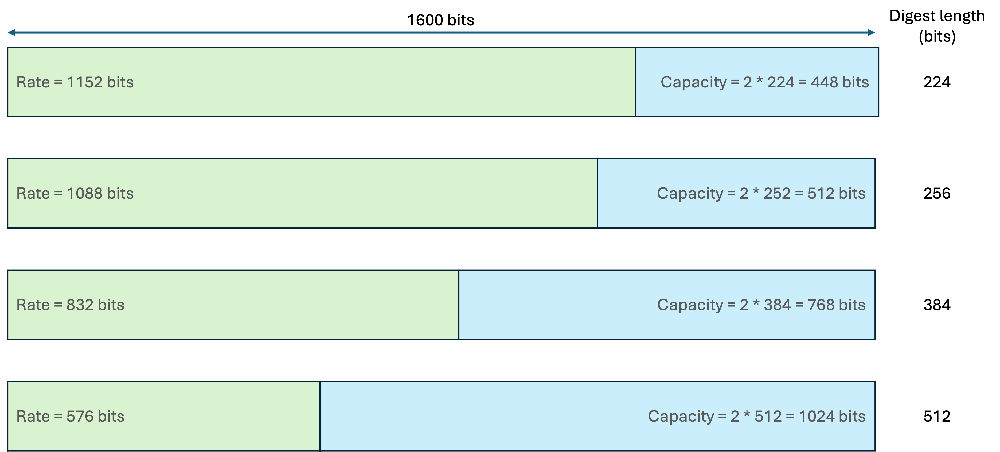

# Sponge Functions

The hash function used by SHA3 belongs to a family of functions known as "sponge" functions.
These functions are entirely deterministic; that is, for the same input, they will always yield the same output.

This name has been chosen because, like a physical sponge, it first "absorbs" some quantity of data into its internal state, then "squeezes" out a result.

The absorb and squeeze phases are strictly sequential: until the absorb phase has run to completion, the squeeze phase is unable to produce any meaningful output.

What makes the SHA3 function fundamentally different from the earlier SHA1 or SHA2 functions, is that the "squeeze" operation can be performed an unlimited number of times; hence, when used in Extendible Output Function (XOF) mode, the SHA3 function can act as a psuedo-random number generator.

## Absorb Phase

During the absorb phase, the SHA3 algorithm takes in data much like a sponge absorbs water.
The sponge function consumes input data in blocks whose size is determined by the formula described below.
The size of this input block determines the rate at which the input data can be consumed; hence this block size is known as the `rate`.

The absorb phase runs until all the input data has been consumed, at which point, the SHA3 function's internal state is ready to generate output data.

Now, one or more iterations of the squeeze phase can take place.

## Squeeze Phase

If the squeeze phase runs just once, then the first `d` bits of the output value act as a drop-in replcement for a digest of length `d` bits generated by the SHA2 function.

However, the squeeze phase can be run multiple times, thus allowing SHA3 to behave as a psuedo-random number generator.

# SHA3 Internal State

The SHA3 algorithm is fed input data that is used to manipulate its internal state.

All operations acting on the internal state treat it as a 3-dimensional matrix having the dimensions `5 * 5 * w`, where `w = 2^l` and `l` is an integer in the range `0..6`.

Thus, the size (`b`) of the internal state in bits may only be one of:

| `l` | Formula | Internal State Size
|---|---|--:
| `0` | `5 * 5 * 2^0` | `25`
| `1` | `5 * 5 * 2^1` | `50`
| `2` | `5 * 5 * 2^2` | `100`
| `3` | `5 * 5 * 2^3` | `200`
| `4` | `5 * 5 * 2^4` | `400`
| `5` | `5 * 5 * 2^5` | `800`
| `6` | `5 * 5 * 2^6` | `1600`

Choosing values of `l < 3` gives state sizes that are only of use when analyzing the algorithm's behaviour.
Such values should not be used in practice.

However, implementing SHA3 as a SHA2 replacement requires `l` to be fixed at `6`, meaning that the internal state will always be `1600` bits.

## Partitioning the Internal State

The internal state (of size `b`) is subdivided into two regions known as the `rate` (of size `r`) and the `capacity` (of size `c`) such that `r + c = b`.  Therefore in our case, `r + c = 1600`.

### Rate

The `rate` is the region into which the input data is written and from which the output digest will be taken.
It has this name because its size determines the rate at which the input data can be consumed.

The larger the rate, the faster the input file can be processed; however, this comes at the cost of a lower security level.

### Capacity

The remainder of the internal state is a region known as the `capacity`, and this is ***never*** made public.

Its purpose is to act as a hidden entropy pool into which the data bits in the `rate` are thoroughly mixed.

### Security Level

The algorithm's security level is tied to the digest size since the size `c` of the capacity must always be twice the size of the required digest length `d`.

Thus `c = 2d`, making `r = 1600 - 2d`.

Given this constraint, the sizes of `r` and `c` may only be one of the following pairs (in bits):

